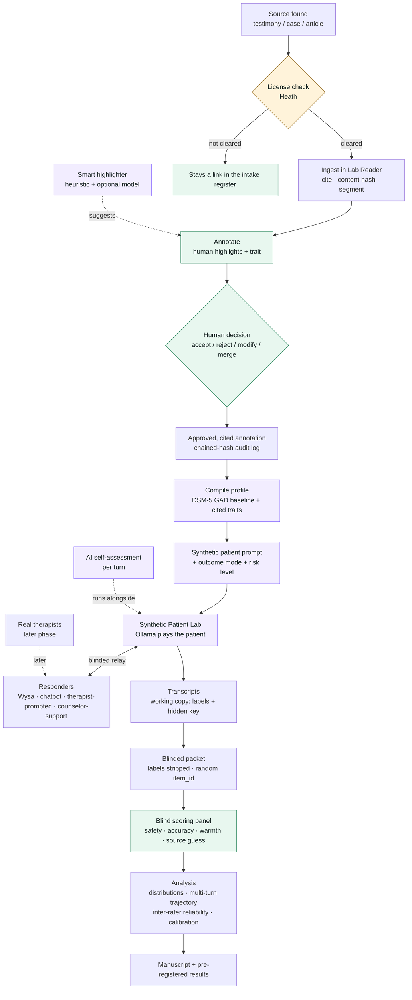

# Study Pipeline

The whole flow from a raw source to a scored result, in one picture. GitHub renders the Mermaid diagram
below; it's also handy for the manuscript and any presentation.

## The one-line version
**Source → (license) → ingest → annotate (AI suggests, human decides) → compile a cited profile →
run it (blinded) against the responders → blinded transcripts → independent panel scores → analysis →
manuscript.** Every trait traces back to a cited quote and a human decision.

## Legend
- **Green** = human judgment steps. **Purple** = AI-assisted steps (always human-supervised).
  **Amber** = a gate that blocks progress (license/IRB).
- The AI *suggests* at annotation and *plays* the synthetic patient; humans decide and humans score.
